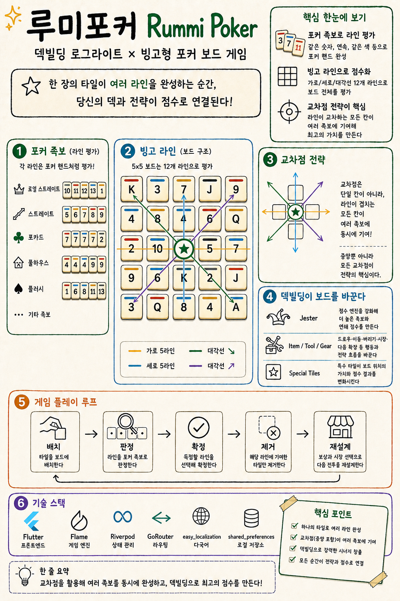

# Rummi Poker Grid (`rummipoker`)

**루미 포커 그리드**는 Flutter/Flame 기반 보드형 덱빌딩 로그라이트입니다. 레거시 탭탭 게임은 제거되었고, `lib/logic/rummi_poker_grid/` 엔진과 Flutter 화면 기반의 전투, 정산, Market, 저장/복귀 루프가 연결되어 있습니다.

현재는 공모전 제출 트랙을 닫고 post-contest 런타임 고도화를 진행 중입니다. 다음 작업 기준은 [`START_HERE.md`](START_HERE.md)에서 진입한 뒤 [`docs/planning/ACTIVE_EXECUTION_PLAN.md`](docs/planning/ACTIVE_EXECUTION_PLAN.md)의 활성 트랙을 따릅니다.



## 현재 초점

- 아이템/덱빌딩 정책 정화: Balatro 참고 축을 직접 복사하지 않고 Board-Line Ritual, 족보 성장, 타일 modifier, 마켓 pool mutation으로 재분류
- 특수 타일 modifier V1: 데이터 모델, 저장/복원, Market 표시, 전투/정산 반영
- Item/Jester/Tool/Gear 런타임 정책: 상한, no-op, 가격/가치 probe, source-target-result 연출
- runtime state와 transient presentation/dialog/animation state 분리
- 장기 S1~S8 밸런스, 경제, 자연 full-play QA 재검증

공모전 관련 문서는 현재 작업 큐가 아니라 닫힌 제출 이력과 증거 참고로만 봅니다.

## 기술 스택

- **Flutter** — UI
- **Flame** — 렌더링/오디오 등 게임 기능 기반
- **GoRouter** — 라우팅
- **easy_localization** — 다국어 리소스
- **flame_audio** — BGM·SFX
- **shared_preferences** — 설정·active run 저장
- **Riverpod** — 세션 등

## 앱 구조 (요약)

```
lib/
├── main.dart, app.dart, router.dart, app_config.dart
├── logic/rummi_poker_grid/   # 타일·보드·덱·세션 (Flame 무관)
├── views/                    # home/title, new-run, blind-select, game, market/archive/settings UI
├── resources/, services/, utils/, widgets/, providers/
```

| 경로 | 설명 |
|------|------|
| `/` | Home/Title — 이어하기, 새 시작, 특별 모드, 기록실, 설정 진입 |
| `/new-run` | 새 게임 시작 설정 |
| `/blind-select` | 블라인드 선택 |
| `/game` | 전투/정산/Market 런타임 |
| `/setting` | 볼륨·화면 설정 |
| `/trial` | 특별 모드 placeholder |
| `/archive` | 기록실 shell |

## 문서

- [`START_HERE.md`](START_HERE.md) — 새 세션 최상위 진입점과 읽는 순서
- [`docs/00_docs_README.md`](docs/00_docs_README.md) — 전체 문서 분류와 source of truth 기준
- [`docs/current_system/CURRENT_SYSTEM_OVERVIEW.md`](docs/current_system/CURRENT_SYSTEM_OVERVIEW.md) — 현재 시스템 요약
- [`docs/current_system/CURRENT_CODE_MAP.md`](docs/current_system/CURRENT_CODE_MAP.md) — 코드 탐색 순서와 책임 경계
- [`docs/current_system/CURRENT_TO_V4_GAP.md`](docs/current_system/CURRENT_TO_V4_GAP.md) — 현재 구현과 장기 목표 사이의 차이
- [`docs/planning/ACTIVE_EXECUTION_PLAN.md`](docs/planning/ACTIVE_EXECUTION_PLAN.md) — 현재 활성 작업과 다음 실행 순서
- [`docs/planning/goal/OVERALL_GOAL_PROGRESS.md`](docs/planning/goal/OVERALL_GOAL_PROGRESS.md) — 장기 Goal 진행 상태
- [`docs/specs/V4/00_README.md`](docs/specs/V4/00_README.md) — V4 기능 명세 진입점
- [`docs/release/web_build.md`](docs/release/web_build.md) — Web 빌드

`docs/archive/competition_history_2026_06/`은 닫힌 공모전 제출 이력과 증거 참고입니다. `docs/archive/` 문서는 레거시 참고 자료이며, 현재 기준과 충돌하면 실제 `lib/` 코드와 테스트, `AGENTS.md`, `START_HERE.md`, `docs/00_docs_README.md`, `docs/current_system/*`, `docs/specs/*`, `docs/planning/*` 순서로 우선합니다.

## 실행

```bash
flutter run
```

웹: `flutter run -d chrome`

## 검증

```bash
flutter test
flutter analyze
```

모바일 실구동/스크린샷 스모크:

```bash
tools/ios_sim_smoke.sh
```

Web 저장/라우팅/입력 경계 스모크:

```bash
tools/web_build_smoke.sh
```

## 빌드

| 플랫폼 | 명령어 |
|--------|--------|
| Android/iOS | `flutter build apk` / `flutter build ios` |
| Web | `flutter build web --release --base-href "/rummipoker/"` |

→ 상세: [`docs/release/web_build.md`](docs/release/web_build.md)
